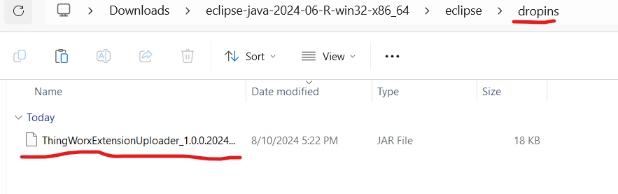
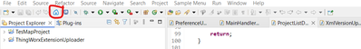
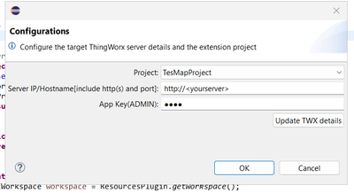
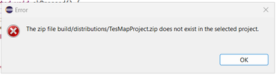
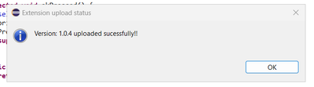

<h1 align="center" style="border-bottom: none">
    <b>ThingWorx Extension Uploader, an Eclipse Plugin</b>
</h1>
<h4 align="center">An open-source tool to auto-upgrade, build, and upload ThingWorx extensions from the Eclipse IDE</h4>
 

    
    
    

 

 
 

## How to Use?

 

Download the `.jar` file from the [release page](https://github.com/WGLabz/ThingWorxExtensionUploader/releases) and place it into the `dropins` folder of your Eclipse IDE.

Restart Eclipse IDE. Once restarted, you'll see a new icon in the toolbar of your IDE.

You can now use the plugin. When you click the icon, the following dialog will appear:

In the dialog, select the extension project, set the server address, and add an `appKey` with Admin-level access. Be sure to click "Update TWX details" to save the details for future use.

> Note: Ensure that you have compiled your extension outside of this plugin at least once and refreshed the project content. This is a known bug that I am working on. Otherwise, you will receive the following error:

If everything goes well when you click "OK", you will receive a success message, and the extension will be deployed to the server.

## How to Build?

To be continued...

## License

Distributed under the AGPLv3 License. See `LICENSE.md` for more information.

 
